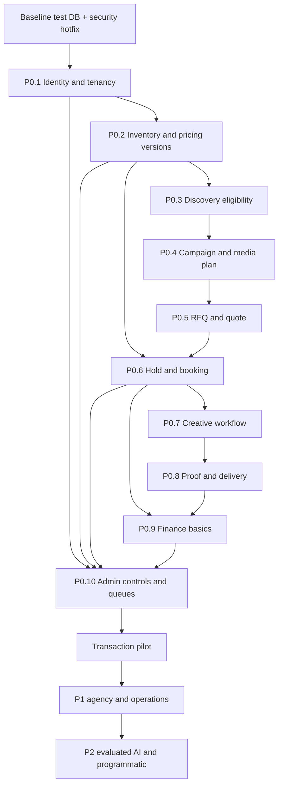

# Target domain, backlog và migration plan

Đây là kế hoạch đề xuất sau audit, **chưa thực hiện thay đổi ứng dụng hoặc migration**. Baseline: `112e2aa4432d65ed85dcd4ac730e8093854e8476`. Không ước lượng ngày công khi chưa biết năng lực team. S/M/L/XL là độ lớn tương đối gồm rủi ro dữ liệu/integration, không cam kết thời gian. Suggested owner là vai trò, không gán việc cho cá nhân chưa được chỉ định.

## 1. Kiến trúc giữ lại và phần cần tách

Giữ monolith Laravel + Filament-native Resource/Page/Action/Form/Table cho các panel. Giữ Site, Screen, Product, discovery services, membership/invitation, policy consent và review controls. Web buyer có thể tiếp tục dùng Blade; điều quan trọng là dùng chung domain actions và permission backend với API/Filament.

Không đổi public URL đồng loạt. Map `/publisher` thành owner capability; `/my` thành buyer workspace; bổ sung media plan/RFQ/quote vào navigation hiện có và thêm alias/redirect có kiểm soát nếu cần sitemap mục tiêu. Lưu ý `/explore/{screen}` phải được đặt sau static routes compare/favorites khi bổ sung.

### Target domain model

| Aggregate / entity | Quan hệ, invariant | Strategy với dữ liệu hiện tại |
|---|---|---|
| TenantContext / Membership / Role | Current tenant phải là active membership; permission kiểm action, network/client/campaign; admin finance/security tách | Giữ Owner và Organization riêng giai đoạn đầu; xây context adapter. Không merge tenant root ngay hoặc suy ra membership từ current_* ID |
| Site → MediaUnit | Site vật lý có nhiều unit; type static/digital; specs/version/verification độc lập | Dùng Screen ID làm unit ID để giảm churn; tách device identity khỏi Screen dần. `screen_count_override` cần reconciliation, không tự nhân bản vật lý |
| SellableProduct / CompositionVersion | Một unit nhiều cách mua; package nhiều units với quantity/substitution rules | Giữ Product/product_screens, thêm version và sellable spec; migrate legacy grouping thành product composition rõ ràng |
| RateCard / RateCardVersion / PriceComponent | Effective from/to, currency, public list/net vs floor/cost, VAT/fee/discount, approvals; version đã publish bất biến | IO/CPM hiện hành thành legacy version có provenance; không suy diễn lịch sử. Unknown prices vào data-quality queue |
| Campaign → MediaPlan → PlanVersion → PlanLine | Brief, scenario A/B/C, comments; accepted version immutable | Cart chỉ là draft buffer; converted cart nối tới campaign/plan legacy. Approval history thiếu phải ghi unknown, không giả chữ ký |
| RFQ → OwnerRequest → QuoteVersion → QuoteLine | Một RFQ fan-out owner; SLA/response/expiry riêng; accept atomically freezes terms | Booking pending cũ giữ flow compatibility, không tự bịa negotiation history để chuyển thành RFQ |
| Booking → CommercialLine → Allocation | Snapshot product/price/terms/specs; mỗi line có nhiều physical/time allocations; status transitions có actor/reason | Campaign không tiếp tục gánh cả booking lifecycle. Giữ booking_lines làm bridge bằng booking_id, legacy source IDs; không mất liên kết report/payment |
| Hold / CapacityBucket / Allocation / Block | Static exclusive dates; digital slots/SOV theo timezone/daypart/channel; held+booked+owner-content+direct+programmatic ≤ capacity | AvailabilityService trở thành adapter đọc ledger mới; legacy confirmed lines backfill allocations, conflicting/ambiguous rows phải quarantined |
| Creative → CreativeVersion → Assignment → Approval | Technical validation và review theo unit/booking; file/version immutable; rejection reason | Legacy Creative thành v1 có state gốc; chưa có assignment thì cần review, không tự approve toàn bộ |
| DeviceCredential → ProofEvent → ProofReview → DeliveryRollup | event_id unique, signature, timestamp; liên kết device/unit/booking/creativeVersion hợp lệ; late events có policy | Giữ raw impression_logs; thêm external-ID mapping. Chỉ map campaign numeric cũ khi có source authoritative |
| Receivable / PaymentIntent / Payment / PaymentAllocation | Theo owner/order; tiền confirmed khác buyer-submitted; idempotency; không tự bù nợ owner khác | Payment.owner_id null vào reconciliation queue; giữ bank ref/history, kiểm lại pending duplicate |
| Invoice / InvoiceLine / CreditNote / Refund / Fee / Settlement | Issuance, adjustment/refund approval, reconciliation; totals/snapshot money nhất quán | invoice_number hiện tại là legacy reference cho tới khi có chứng cứ hóa đơn. Không coi mọi số INV là đã xuất hợp lệ |
| VerificationCheck / Document / AuditEvent / Outbox | Dimension riêng có source/expiry/history; private docs có scoped signed URL; append-only audit; side effects after commit | Giữ policy_consents và campaign_activities làm nguồn lịch sử, đánh dấu mức completeness; không retrofit before/after giả |
| Dispute / Evidence / Decision / FinancialAdjustment | Gắn booking/contract/proof; resolution có authority + actor + financial effect | PublicReflection giữ riêng đúng nghiệp vụ, không đổi nhãn thành dispute |

### Dependency graph

Các control P0.10/audit/permission được làm cùng epic gây ra mutation, không đợi cuối mới gắn. Hotfix F01/F02/F04/F06/F07/F08 có thể bắt đầu trước domain migration lớn. P0.9 chỉ chốt khi đã quyết định mô hình thanh toán trực tiếp owner hay thu hộ.

## 2. P0 — epic → capability → story → technical task → acceptance evidence

### P0.1 — Identity & tenancy — L — Backend/Security + QA

Dependencies: baseline DB test; không chờ RFQ schema. Findings: F01/F02/F15/F16.

- **Capability: tenant/action guard. Story I1:** với vai trò viewer/read_only, tôi chỉ xem tài nguyên được cấp. Tasks: đưa TenantContext vào domain actions; authorize CRUD API/Livewire; ability tách inventory read và management; derive owner_id; kiểm active current membership; enforce network/client/campaign boundaries. **AC/evidence:** matrix 7 actor của PDF + role hiện tại, two-tenant HTTP/Livewire tests, stale/revoked membership, ApiClient denied management, no data mutation on denial.
- **Capability: onboarding/team. Story I2:** self-register/invited buyer có quyền panel đúng membership. Tasks: thống nhất creation action và system role; backfill preview accounts thiếu buyer role; explicit tenant switch; tách finance/security cross-tenant permission. **AC/evidence:** tự đăng ký→workspace→team đúng quyền; không nhân bản owner/admin qua crafted requests; invitation expiry/single-use/current membership tests giữ pass.
- **Capability: audit. Story I3:** mọi quyết định bảo mật và giao dịch có trace. Tasks: AuditEvent schema, actor/tenant/target/before-after/reason/correlation; service-level hooks, transaction/outbox. **AC/evidence:** change và denial events có scope, export permission; rollback transaction không gửi notification.

### P0.2 — Inventory foundation — XL — Domain/Backend + Data + Owner Operations

Dependencies: P0.1. Findings: F03/F04/F11.

- **Capability: physical supply/product separation. Story S1:** owner bán đúng unit và gói đã khai. Tasks: formalize Screen→MediaUnit mapping, device separation; composition version; membership validation của selected units; quantity/min/max/lead-time rules; migration mapping report. **AC/evidence:** một site nhiều unit, một unit nhiều product; package selection bảo toàn; unknown/grouped screens bị flagged, không tự bịa số lượng.
- **Capability: price versions. Story S2:** giá đã chấp thuận không đổi khi owner đổi rate card. Tasks: RateCardVersion/PriceComponent/effective dates/approval; server-side quote calculator; public/net/floor/cost fields và DTO; integer minor units hoặc decimal rounding policy; VAT/fee/discount configurable versioned. **AC/evidence:** effective-date/timezone tests; old quote unchanged; range→billable periods consistent; tổng components đúng; price access matrix.
- **Capability: backfill. Story S3:** chuyển dữ liệu mà URL/API cũ tiếp tục hoạt động. Tasks: dry-run mapping, unique legacy_source key, chunk/restart, reconciliation counts/amounts, compatibility adapter. **AC/evidence:** chạy backfill hai lần không duplicate; giá chưa xác định vào exception; IDs cũ đọc được qua adapter; tested rollback.

### P0.3 — Public discovery — L — Frontend + Backend + QA

Dependencies: public price/eligibility contract P0.2; security P0.1. Findings F09/F10.

- **Capability: source-backed explore/detail/map. Story D1:** buyer lọc và xem đúng sản phẩm có thể mua. Tasks: query/filter theo displayed price unit, price currency, format/venue/network/date; canonical route ordering; map/list same query, pagination/empty/error; verification/freshness fields có nguồn; bỏ unconditional trust claims. **AC/evidence:** listing/map/detail count consistency; IO/CPM filter units đúng; inactive/suspended supply bị chặn cả read và add/confirm; HTML/API không lộ internal fields.
- **Capability: compare/shortlist. Story D2:** tôi so sánh 5–10 lựa chọn rồi thêm vào plan giữ product/date/quantity. Tasks: compare/favorites routes trước wildcard; guest shortlist merge khi login; contract add-to-plan; stable snapshot payload. **AC/evidence:** multi-select map→plan đủ selections; compare data đúng rate version; invalid IDs/selection rejected; browser E2E và accessibility checks.

### P0.4 — Campaign & media plan — L — Buyer Product + Backend/Frontend

Dependencies: P0.1/P0.2/P0.3. Findings F03/F04/F11.

- **Capability: versioned planning. Story P1:** planner tạo phương án A/B/C trong cùng campaign. Tasks: MediaPlan/Scenario/Version/Line, budget/market/audience/team; cart as draft adapter; product-to-unit allocations preview; persist quantity/dates/pricing choices. **AC/evidence:** reload/reorder/edit không mất selection; scenario comparison có deterministic totals; tenant/client access tests.
- **Capability: approval/immutability. Story P2:** client/team duyệt đúng phiên bản và thay đổi buộc duyệt lại. Tasks: immutable accepted version, approval action/audit; expiry/revoke share; comments version-scoped; publish proposal from snapshot. **AC/evidence:** approved version không mutate; stale approval rejected; share token expired/revoked/cross-version denied; internal markup redacted. Full agency portal/OTP customization có thể P1, approval domain là P0.

### P0.5 — RFQ & quote — XL — Commercial Product + Backend/Frontend

Dependencies: P0.4, P0.2, P0.1.

- **Capability: RFQ fan-out. Story R1:** một plan xin giá nhiều owner và theo dõi response riêng. Tasks: RFQ/OwnerRequest/Line, deadline/SLA, conversation attachment, notifications/outbox; owner-scoped response. **AC/evidence:** owner A không thấy giá/negotiation B; retry submit không RFQ duplicate; overdue queue actionable; declined/partial response không làm mất request còn lại.
- **Capability: immutable quote acceptance. Story R2:** buyer accept quote còn hiệu lực và chuyển sang booking đúng giá/terms. Tasks: QuoteVersion, price components, validity, counter-offer, accepted quote snapshot, accept action tied to hold; explicit superseded version. **AC/evidence:** expired quote fail; reprice không đổi accepted version; concurrent accept một booking; audit actor/terms; financial totals reconcile.

### P0.6 — Hold & booking — XL — Backend/DB + QA Concurrency

Dependencies: P0.2/P0.5, P0.1; có thể xây allocator trước RFQ UI. Findings F03/F05.

- **Capability: reservation. Story B1:** buyer giữ supply có hạn mà không oversell. Tasks: capacity buckets/timezone/daypart/channel, static exclusive rule, Hold/Allocation/Block; atomic locks và idempotent hold/confirm; expiry scheduler; consistent read model. **AC/evidence:** simultaneous reservations trên DB production-equivalent không vượt capacity; 50% hai nửa tháng không false conflict; expired hold reusable; maintenance/direct/programmatic/owner-content đều tính; map calendar khớp ledger.
- **Capability: booking lifecycle. Story B2:** quote được xác nhận thành nghĩa vụ có snapshot/contract và có cancellation được kiểm soát. Tasks: Booking aggregate tách campaign; allowed transitions + actor; product composition/price/terms/inventory snapshot; IO/PO document; adjustment/cancellation events; compatibility link booking_lines. **AC/evidence:** stale/replayed request không duplicate; failed transaction không orphan allocation; terms immutable; cancellation releases đúng một lần; admin không âm thầm rewrite confirmed snapshot.

### P0.7 — Creative workflow — L — Media Operations + Backend + QA

Dependencies: P0.6/P0.1. Findings F06.

- **Capability: asset/version validation. Story C1:** uploader biết file có đúng specs từng unit không. Tasks: private storage/MIME/size/metadata extraction; duration/resolution validation, immutable version/checksum; booking assignments và expiry; quarantine lỗi. **AC/evidence:** spoofed/wrong spec/oversized file rejected; signed URL scope/TTL; replacement tạo version, không sửa bản đã duyệt.
- **Capability: approval gate. Story C2:** chỉ content được duyệt và assign mới scheduled/live. Tasks: owner/admin approver permissions, rejection reason, review queue; activation action checks schedule/capacity/creative/payment policy; notifications. **AC/evidence:** đủ tiền nhưng missing/rejected/unassigned creative không active; multi-owner partial approval không tự pass phần còn lại; replay quyết định không event duplicate.

### P0.8 — Proof — XL — Device/Integration + Backend + Operations

Dependencies: P0.6/P0.7. Findings F08.

- **Capability: authenticated digital evidence. Story V1:** player gửi PoP đúng booking/creative và retry an toàn. Tasks: device credentials/signature/replay window, ULID contract với external IDs mapping; ProofEvent unique event ID, occurred/received time; booking/time/unit/creative validation; idempotent rollup. **AC/evidence:** duplicate/reordered/late/offline events không double count; sai association/signature rejected; actual totals reconcile với accepted events; load/recovery gate.
- **Capability: static evidence/review. Story V2:** owner nộp ảnh/chứng cứ và xử lý under-delivery. Tasks: evidence upload chain/checksum, review/reject/reason, required/missing/invalid queues; buyer acceptance/report version/export. **AC/evidence:** required proof theo allocation, rejected proof không tính delivered; missing alert theo SLA; evidence quyết định dispute truy được nguồn.

### P0.9 — Finance basics — XL — Finance Product + Backend + QA

Dependencies: quyết định mô hình thanh toán; P0.6; proof acceptance P0.8 cho nghiệm thu/settlement. Findings F07/F12.

- **Capability: owner receivable/payment allocation. Story F1:** buyer chuyển tiền owner nào thì owner đó được ghi nhận đúng. Tasks: receivable per owner/order; intent idempotency; submitted vs verified-paid; explicit admin confirm payment/owner/amount/bank reference; transactional reconciliation; overpayment credit. **AC/evidence:** overpay A không activate B; partial/pending/failed/retry consistent; no duplicate confirmation; invoice/reference numbering race-safe.
- **Capability: invoice/fee/settlement statement. Story F2:** finance đối chiếu phần thu/chi/phí/VAT theo snapshot. Tasks: invoice line/tax/fee components versioned, platform fee vs owner balance, refund/credit note/adjustment approvals, settlement statements và reconciliation exceptions; financial role export. **AC/evidence:** sums balance per currency/owner; điều chỉnh không sửa lịch sử; legacy owner-null payments quarantined; proof-required condition enforced. Gateway thật/e-invoice adapter chỉ gọi capability hoàn chỉnh khi có sandbox evidence, không cần ép tích hợp VNPay/MoMo trước bank-transfer MVP nếu product không yêu cầu.

### P0.10 — Admin operations — L — Marketplace Operations + Backend/Filament

Dependencies: P0.1; control gắn cùng P0.2–P0.9. Findings F09/F13/F16/F17/F18.

- **Capability: trust/data-quality queues. Story A1:** reviewer xác minh từng dimension và phát hiện dữ liệu cũ. Tasks: verification identity/right-to-sell/location/specs/pricing/traffic/proof + expiry/history; freshness/source/completeness; duplicate/invalid/stale queue; import progress/cancel/retention/recovery. **AC/evidence:** expiry thay public badge/eligibility đúng policy; batch 49/50/51 rows và cancel không lỗi/duplicate; private import files; audit reason mandatory.
- **Capability: exceptions/dispute. Story A2:** operator thấy việc cần làm và resolution có financial trail. Tasks: RFQ SLA, hold expiry, conflict, missing creative/proof/payment queues; Dispute/Evidence/Decision liên kết contract và credit/refund; dashboard actionable, owner/buyer notifications. **AC/evidence:** trace issue→assignee→decision→adjustment→closure; cross-tenant access matrix; không sửa trực tiếp confirmed booking; queue age/SLA metrics.
- **Capability: integration recovery. Story A3:** webhook failures không bị mất. Tasks: destination security, stable event IDs, throw/release đúng retry, consumers webhooks/default, after-commit/outbox và delivery history. **AC/evidence:** SSRF policy tests, HTTP500/timeout retry, exhausted alerts; callback receipt reconciliation; production worker config verified.

## 3. Backlog sau P0

| Priority / capability | Dependency | Effort | Suggested owner | Acceptance evidence |
|---|---|---|---|---|
| P1 Agency clients, branded proposals, secure approver portal/OTP | Plan/quote/creative/report versions, P0.1 | L | Buyer Product + FE/BE | Client sees only shared immutable version; markup redaction, revoke/expiry, approval audit |
| P1 Operations work orders/installation/removal/maintenance/incidents | Allocation/proof domain | L | Owner Operations | Assignment/SLA/evidence/acceptance, maintenance blocks feed capacity |
| P1 Credit terms, advanced reconciliation and automated reports | P0.9 ledger + P0.8 | L | Finance + BE | Credit exposure bound, reproducible exports, evidence-linked settlement |
| P1 Messaging/support/document registry | Outbox, tenancy, private files | L | Shared Platform | Booking/RFQ conversation ACL, attachment policies, SLA escalation |
| P1 Resources/solutions/taxonomy SEO landing/CMS | Source-backed public catalog | M | Content + FE | Canonical/indexing tests, scoped content publish/review, real links |
| P2 AI planner/optimizer | Clean inventory/pricing/capacity, ground-truth data, versioned plans | XL | Data/ML + Product | Offline eval dataset, constraint compliance, quality against non-AI baseline, confidence/provenance |
| P2 CMS sync/OpenRTB/VAST/DCO/attribution | Device/proof/capacity and integration contracts | XL | Integrations/AdOps | Sandbox partner trace, retries/idempotency, capacity conservation, signed callbacks |
| P3 Enterprise customization/cross-market scale | Stable P0/P1 and measured demand | L/XL, re-estimate | Architecture + Product | Proven scale/SLO and demand justify work; no speculative rewrite |

## 4. Migration strategy — expand → reconcile → switch → contract

### M0 — Chốt baseline và data contract

1. Gắn audit/release/test artifacts với SHA và schema dump read-only. Xác nhận DB engine/version, deploy config, external worker integrations và scope static/DOOH.
2. Profile số lượng/null/orphan/duplicate của sites/screens/products/pivots/carts/booking_lines/payments/impression_logs. Đếm theo owner và campaign, không export PII không cần thiết.
3. Thống kê ambiguous inventory group, booking product_id null, giá zero/khác currency, completed payment owner_id null, quote/terms không tồn tại, PoP integer IDs chưa có mapping. Các case này vào exception queue có người chịu trách nhiệm.
4. Vá security và chặn các ghi mới sai trong code cũ trước khi backfill. Không cố normalize lịch sử bằng giá hiện tại.

### M1 — Expand schema, giữ compatibility

- Thêm bảng/nullable bridge keys/indexes mới: rate versions, plan/quote versions, booking/allocations/holds, creative versions/assignments, proof events, payment allocations/audit/outbox. Unique key `(legacy_source, legacy_id)` cho backfill idempotent.
- Giữ các bảng/cột/API hiện tại trong thời gian chuyển tiếp. Server adapter đọc snapshot/version mới nếu có, fallback legacy có marker chất lượng; không rơi về giá zero silently.
- Bổ sung indexes theo owner/status/dates/device/event ID sau profiling trên DB thật. Constraints xây dần sau khi reconcile orphan; giới hạn lock time/chunk size đo trên staging clone.
- Một authority cho mỗi bước ghi. Nếu cần dual-write trong transition, thực hiện cùng transaction và outbox; không cho hai calculator/allocator độc lập cùng quyết định số liệu.

### M2 — Backfill có kiểm chứng, không sáng tác lịch sử

| Nguồn | Đích | Rule / exception | Reconciliation gate |
|---|---|---|---|
| Screen/Site/ScreenSpec | MediaUnit projection + Device mapping | Giữ IDs; cluster/override cần operator resolve | Count theo owner/site, no orphan, stable URLs |
| ScreenInventory IO/CPM, Product prices | Legacy RateCardVersion | known current values, source captured_at; unknown past validity flagged | Decimal/currency/units, zero/negative rates quarantined |
| product_screens | CompositionVersion | Giữ primary/order; unit-owner inconsistent → review | N selected/allocation lines reconcile; no silent dropped units |
| Cart/Campaign/BookingLine | Plan legacy + Booking + Allocation | Historical product_id null không suy ra first product; frozen cost giữ nguyên; capacity conflict explicit | Totals/screens/dates per campaign, occupancy report; overbooked data not hidden |
| Creative/pivot | v1 + existing known assignments | Không có assignment → pending operations review | File checksum/path availability, no auto-approval |
| ImpressionLog | Raw legacy evidence + optional mapped ProofEvent | integer external IDs chỉ map khi có authoritative mapping; provenance retained | Accepted/rejected/unmapped counters, no duplicate counts |
| Payment | Legacy payment + allocation/reconciliation queue | owner null/overpaid/duplicate not auto-paid; INV reference not auto-issued invoice | Sum balances per owner/currency/campaign before/after |
| CampaignActivity/PolicyConsent | Historical audit index | Mark missing before/after; preserve original timestamp/actor | Record counts/hash sampling; no fabricated approvals |

Backfill từng batch nhỏ với cursor/checkpoint; resume chỉ tạo missing keys; lưu batch ID và mapping report. Không dùng destructive overwrite. Mỗi batch có verification counts/amounts/orphans và rollback plan trước khi đi tiếp.

### M3 — Shadow reads rồi pilot theo tenant

- Chạy calculator/read model mới ở shadow mode, so giá/date/unit/capacity với legacy và điều tra từng divergence. Shadow không tạo hold tài chính/capacity thật.
- Pilot owner/buyer được chọn, feature flags theo tenant/capability. Đối với booking mới dùng một allocator authority; bookings cũ tiếp tục adapter đọc immutable legacy snapshot.
- Theo dõi: authorization denies, stale memberships, pricing diff, capacity conflict rate, hold age/expiry lag, pending creative age, accepted/rejected/dedup PoP, unpaid owner balance, webhook/outbox lag, import partial failures.
- Rollout tăng phạm vi khi security/concurrency/finance reconciliation gates pass. Không đưa AI planner vào đường production quyết định giá/capacity ở giai đoạn này.

### M4 — Rollback / recovery

- Rollback UI/feature flag về read-only hoặc legacy-compatible paths khi invariant fail; **không** tắt allocator mới rồi cho flow cũ tiếp tục bán cùng inventory thiếu lock. Dừng ghi booking/finance bị ảnh hưởng, giữ xử lý đang diễn ra an toàn.
- Dữ liệu booking/financial/proof mới giữ append-only; rollback bằng version/compensating events có audit, không xóa giao dịch đã xác nhận.
- Backfill chưa dùng cho transaction có thể revert đúng batch dựa mapping và checksum; không overwrite row đã được sửa sau batch. Reconcile trước mở ghi lại.
- Drill restore backup trên staging clone, thử worker restart/outbox replay/hold expiry và failure giữa multi-step write. Thời gian khôi phục/SLO do team chốt sau đo, không đặt số giả.

### M5 — Contract sau ổn định

Chỉ bỏ legacy fields/endpoints khi không còn consumer ghi/đọc trực tiếp, snapshots đã reconcile, rollback window kết thúc và external IDs đã có mapping ổn định. Public API version/deprecation notice phải được duyệt riêng; audit này không tự thay contract đang dùng.

## 5. Quality gates bắt buộc

| Gate | Bằng chứng tối thiểu trước pilot | Hiện tại |
|---|---|---|
| Q0 Reproducible baseline | Fresh schema + upgrade legacy fixture trên DB được chốt, full test suite output gắn SHA | FAIL: SQLite SHOW INDEX; chưa chạy hết suite |
| Q1 Authorization/tenancy | Mọi entrypoint HTTP/API/Livewire: authorized, role-denied, cross-tenant, stale membership, suspended principal; snapshot/file/export redaction | PARTIAL source coverage team/panel; gaps F01/F02 |
| Q2 Pricing/immutability | Date/quantity/server pricing, currency rounding, effective versions, quote expiry, old booking unchanged, min/max rules | Missing critical regression scenarios |
| Q3 Capacity concurrency | N parallel requests trên DB production-equivalent, max occupancy invariant, expired/cancelled hold, lock contention/retry, static/digital/daypart | NOT VERIFIED; no allocator/hold domain |
| Q4 Lifecycle | Transition table test; payment đủ nhưng creative chưa duyệt không live; mixed owner responses; cancellation/adjustment gate | BROKEN paths F05/F06/F07 |
| Q5 Idempotency/recovery | Same request/event/payment import batch replay, worker timeout/restart, transient failures; exactly one business effect | Missing transaction coverage; webhook/import defects |
| Q6 Proof/reconciliation | Valid IDs/linkage/signature/time, duplicate rejection, raw→accepted→rollup totals; per-owner financial balance | BROKEN ID pipeline F08 |
| Q7 Upload/webhook security | MIME/content/size, private ACL/signed expiry, retention, SSRF/DNS/redirect destination policy | Global upload tests exist; flow gaps |
| Q8 Performance/observability | Query counts/p95 under measured dataset, pagination/map bounding, lock wait, queue lag/failure alarms, correlation IDs | No benchmark executed; existing performance indexes not proof of throughput |
| Q9 Rollout/rollback | Feature-flag drill, old API compatibility, backup restore, batch compensation, finance audit trail | Planned only |
| Q10 Independent review | Claude review cùng SHA, disagreements reproduced and resolved by evidence | Pending external report |

Không dùng SQLite để khẳng định row-level lock correctness của MySQL. Không coi 207 route hoặc 226 test methods là maturity score. Không làm thêm UI trước các invariant giá/capacity/permission chỉ để tăng số trang.

## 6. Thứ tự thực hiện đề xuất

1. Baseline test runtime/CI và security patch F01/F02; gate public eligibility, price tampering, activation/payment allocation và PoP ID trong flow hiện hữu. Đây là release blockers có thể xử lý incremental.
2. P0.2 + P0.4/P0.5: commercial versions và snapshots, sửa product selections; approval domain.
3. P0.6 + P0.7: booking/hold/capacity state machine và creative gate.
4. P0.8 + P0.9: proof đủ căn cứ và finance reconciliation; admin queues/audit luôn đi kèm.
5. Pilot có bộ test/quality gates, rồi mở P1. P2 chỉ khi có dữ liệu sạch và evaluation.
