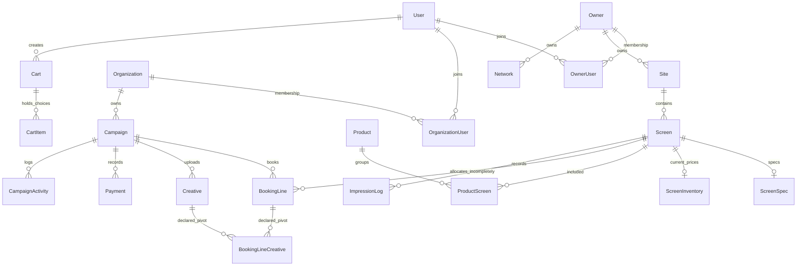

# OOHX — Audit codebase theo sitemap 5 vùng

Ngày audit: 23/09/2026. Người thực hiện: Codex. Tài liệu chuẩn: [OOHX_5_Vung_Sitemap_Review_Plan.pdf](../OOHX_5_Vung_Sitemap_Review_Plan.pdf), v1.0, 22/09/2026.

## Kết luận điều hành

**Maturity: lead marketplace có workflow booking/thanh toán sơ bộ; chưa đạt transaction marketplace theo Definition of Done trong PDF.** Đây là đánh giá từ code và runtime cục bộ, không phải kết luận về dữ liệu production.

Đã có discovery truy vấn database, Site/Screen/Product riêng, giỏ hàng, campaign, booking lines, owner approval, upload creative, payment theo owner, reports, policy consent, invitation và ba Filament panel. Không phải chỉ có menu hoặc mock. Tuy nhiên, chuỗi giao dịch chưa bảo toàn lựa chọn sản phẩm, giá, capacity, quyền theo vai trò và bằng chứng delivery. Buyer vẫn cần trao đổi/xác nhận ngoài hệ thống; RFQ, quote có version, client approval, contract, settlement và dispute giao dịch chưa có implementation tương ứng.

**Không đề xuất rewrite.** Giữ Laravel/Filament, mô hình Site/Screen, discovery, membership, invitation và các workflow có giá trị; bổ sung domain giao dịch bằng migration tăng dần. Phải vá ranh giới bảo mật và các lỗi transaction trước khi mở rộng AI/programmatic.

### Mười gap lớn nhất

| # | Gap | Ưu tiên | Bằng chứng / finding |
|---|---|---|---|
| 1 | API Site/Screen thiếu authorization; ApiClient được bỏ owner scope nhưng vẫn có thể đi vào CRUD quản trị | P0, Critical | F01 |
| 2 | Role viewer/read_only và trạng thái membership chưa được áp nhất quán lên các hành động thương mại | P0, High | F02 |
| 3 | Product/package → booking chỉ lấy first screen, bỏ product_id và selection | P0, High | F03 |
| 4 | Số kỳ tính tiền do client gửi và cập nhật ngày không được ràng buộc; snapshot không đầy đủ | P0, High | F04, F11 |
| 5 | Không có hold có TTL, allocation atomic, phân biệt static/DOOH/daypart; pending draft chặn lịch | P0, High | F05 |
| 6 | Thanh toán kích hoạt toàn campaign theo tổng tiền, bỏ qua owner còn nợ và creative gate | P0, High | F06–F07 |
| 7 | PoP dùng integer campaign/creative ID trái với ULID; chỉ UUID screen, thiếu dedup và booking linkage | P0, High | F08 |
| 8 | Thiếu media plan versions/approvals, RFQ, negotiation, quote expiry và snapshot terms | P0, High | G-B02/G-B03 |
| 9 | Thiếu invoice lifecycle, reconciliation, refund/adjustment/settlement và dispute; verified/claim chưa có chứng cứ đủ | P0/P1 | F09, G-A02/G-A03 |
| 10 | Test mặc định không dựng được schema SQLite; chưa có transaction/concurrency gates và CI test trước deploy | P0, High | F14 |

## Snapshot, phương pháp và giới hạn

| Thông tin | Giá trị |
|---|---|
| Repository | `D:\Code-Project\oohx-matrix\oohx-dash` — Laravel monolith, không phải monorepo nhiều app |
| Branch | `feat/tmdt-review-1107` |
| Commit | `112e2aa4432d65ed85dcd4ac730e8093854e8476` |
| Working tree lúc bắt đầu | Đã có thay đổi của người dùng tại `.claude/settings.local.json`; không đọc/chỉnh nội dung này |
| Phạm vi database | Đọc model/migration; không truy cập DB nghiệp vụ hoặc production |
| Runtime | Image có sẵn `captain-test-php:8.4`, PHP 8.4.25, mạng tắt, source mount chỉ đọc, SQLite RAM |
| Thao tác | Đọc/tra cứu code, hash inventory, route:list, PHPUnit, probe dữ liệu giả; chỉ ghi tài liệu/harness/kết quả trong thư mục audit |
| Không thực hiện | Sửa source ứng dụng, migration mới, commit/PR, deploy, gửi email thật, remote SSH/Data Engine, thay đổi stack Docker đang phục vụ ứng dụng |
| Review thứ hai | Chưa có báo cáo Claude độc lập cùng SHA. Đây là vòng Codex, không giả định đã hoàn thành bước hợp nhất hai agent của PDF |

Đọc theo chuỗi Page → route → controller/Filament action → service → model/migration → permission → test. Các báo cáo audit cũ trong repo không được dùng làm bằng chứng kết luận vòng này. Tên route khác PDF không tự động được coi là thiếu chức năng: `/publisher` là owner portal; `/my` là workspace buyer; `/buyer` trên dashboard host chủ yếu quản lý team.

Inventory: **585 file được lập manifest**, **54 model**, **31 file service**, **24 controller** (kể cả base controller), **71 migration**, **22 test class/file có phương thức test**, **226 phương thức `test_*`**; data providers có thể tạo nhiều case hơn. Hai queued job riêng: ImportScreensJob và SendWebhookJob. Thống kê bảng trong JSON chỉ liệt kê tên literal `Schema::create`, không bao gồm bảng tên động của Spatie.

- [Module map và symbol](MODULES.md)
- [207 route thực tế, domain, trạng thái, source](SITEMAP.md)
- [Manifest file/hash/symbol/schema](evidence/source-inventory.json)
- [Danh sách test](evidence/test-inventory.json)
- [Findings chi tiết](FINDINGS.md)
- [Domain đích, migration, backlog, quality gates](PLAN.md)
- [Lệnh tái hiện và danh mục artifact](REPRODUCE.md)

### Quy ước trạng thái

`IMPLEMENTED_E2E`: đáp ứng toàn Definition of Done, có bằng chứng runtime/test cho happy/negative/conflict/retry. `PARTIAL`: có implementation thật nhưng thiếu gate hoặc coverage. `BACKEND_ONLY` / `FRONTEND_ONLY`: chỉ có một phía. `STUB/MOCK`: placeholder/claim chưa có thực thi. `BROKEN`: đã trace được sai logic/hợp đồng. `MISSING`: không tìm thấy implementation sau kiểm kê các lớp liên quan. `NOT_VERIFIABLE`: phụ thuộc ngoài repo/runtime chưa truy cập.

**Không capability thương mại lớn nào được gắn IMPLEMENTED_E2E trong vòng này.** Không đồng nghĩa tất cả đều hỏng: baseline test đang bị chặn và nhiều negative/concurrency path chưa có test.

## Actual sitemap và gap matrix theo 5 vùng

Các endpoint HTTP đã đăng ký được liệt kê đầy đủ trong SITEMAP.md. Bảng dưới là đánh giá capability, không đếm menu thành tính năng. Các test dẫn dưới đây là source coverage hiện có, chưa được xác nhận pass trong lượt chạy này.

### 01 — Public Marketplace

| ID / target | Current route / implementation | Status | Thiếu / tác động | Priority / test evidence |
|---|---|---|---|---|
| G-P01 Home, discovery | `/`, `/explore`, `/map`; FrontpageController → FrontpageService, Screen/Site/Owner | PARTIAL | Có filter/sort/page/query thật; chưa có bản đồ chọn nhiều product/date/quantity xuyên suốt; filter giá vẫn dùng floor CPM khi headline có thể là IO | P0; PublicVisibilityGateTest, InventoryScreensFilterTest/MapTest kiểm tra API liên quan, không thay thế browser test |
| G-P02 Detail, availability | `/explore/{screen}`, UUID/ID redirect sang slug; detail calendar đọc booking lines | BROKEN | Hiển thị Floor CPM, claims cố định; calendar cộng SOV sai giữa nhiều line; dữ liệu forecast chưa là allocation | P0; F05/F09 |
| G-P03 Compare/favorites | `POST /save/{screen}` có SavedItem; không có `/explore/compare`, `/explore/favorites` | PARTIAL / MISSING | Có toggle lưu theo user; thiếu trang shortlist/compare 5–10 inventory và guest merge | P0/P1; chưa tìm thấy test riêng |
| G-P04 Packages | `/products`, `/products/{slug}`; ProductService và product_screens | BROKEN | Listing thật, nhưng checkout mất selection; chưa có substitution/package availability | P0; F03 |
| G-P05 Owner/agency directory | `/owners`, `/owners/{owner}`, `/agency` | PARTIAL | Owner profile/review có dữ liệu DB; agency là organization type=agency, không thấy detail/moderation riêng `/agencies/{slug}` | P1; OwnerReviewTest, PublicVisibilityGateTest |
| G-P06 Trust/resources/SEO | `/sitemap.xml`, policy slug từ config, public reflections | PARTIAL / MISSING | Có SEO meta/canonical và policy; thiếu resource CMS, solutions, methodology/verification workflow, SEO landing theo taxonomy rõ ràng | P1; PolicyPagesTest, PublicReflectionTest; F09 |

### 02 — Buyer / Agency

| ID / target | Current route / implementation | Status | Thiếu / tác động | Priority / test evidence |
|---|---|---|---|---|
| G-B01 Campaign | `/cart`, `/booking/create`, `/my/campaigns/{campaign}` → Cart/CampaignService | BROKEN | Có brief, dates, budget, lines; product mapping và duration sai, viewer không bị chặn đầy đủ | P0; F02–F04; chưa có booking E2E test |
| G-B02 Media plan | Cart.name=`My Plan`, cart_items; không có MediaPlan entity | PARTIAL | Thiếu A/B/C, version, comments, immutable approval, signed share, client workspace | P0 |
| G-B03 RFQ/quote | BookingInbox là approve/reject booking; không tìm thấy RFQ/Quote model/service/route/migration | MISSING | Không negotiation, split RFQ theo owner, quote version/expiry/acceptance | P0 |
| G-B04 Hold/booking | BookingController::submit → validateCampaign → CampaignService::submit | BROKEN | Không hold TTL/atomic allocation; thiếu IO/PO, cancellation/adjustment lifecycle | P0; F05 |
| G-B05 Creative | `/booking/{campaign}/creative`; CreativeResource của admin | PARTIAL | MIME/size, trạng thái review có thật; thiếu spec validation, versions, assignment thực thi, rejection reason, activation gate | P0; F06; LivewireUploadSecurityTest chỉ kiểm tra upload khác |
| G-B06 Reports | `/my/campaigns/{campaign}/report` → CampaignReportService | BROKEN | Có query reports thật; player không nhận ULID, không có writer actual_impressions/actual_spots trong app, thiếu evidence approval/export | P0; F08 |
| G-B07 Billing | `/booking/{campaign}/payment*` → PaymentService | BROKEN | Ghi nhận chuyển khoản owner; thiếu idempotency/owner settlement/invoice lifecycle, activation theo tổng campaign | P0; PaymentPerOwnerTest; F07/F12 |
| G-B08 Clients/team | `/buyer/team` (dashboard host); organization_users | PARTIAL / MISSING | Team policy có; thiếu agency→client membership và role theo campaign; self-register không gán system role buyer | P0/P1; OrgUserPermissionTest; F02/F15 |
| G-B09 Client approval | Không có `/review/media-plan|quotation|creative|report/{secure-token}` | MISSING | Không version lock/OTP/expiry/approve audit | P1 portal, P0 approval domain |

### 03 — Media Owner

| ID / target | Current route / implementation | Status | Thiếu / tác động | Priority / test evidence |
|---|---|---|---|---|
| G-O01 Supply | `/publisher/sites`, `/screens`, `/networks`, `/products` CRUD Filament | PARTIAL | Site→Screen và product pivot có thật; Screen vẫn pha physical/device fields; Product permission thiếu | P0; F02/F11; OwnerUserPermissionTest chỉ team |
| G-O02 Rate cards/capacity | ScreenInventory IO/CPM + Product prices; AvailabilityService | PARTIAL / MISSING | Không RateCard version/effective period, owner-content/direct/programmatic/daypart allocation, maintenance hold ledger | P0; F04/F05/F11 |
| G-O03 RFQ/booking | `/publisher/booking-inboxes/{record}` → CampaignService | PARTIAL | Scope line owner ở UI có; chỉ approve/reject, không counter-offer/SLA/fulfillment | P0; BookingInboxBuyerContactTest; F02 |
| G-O04 Creative/operations/proof | Creative summary trong booking; player API thuộc Shared | PARTIAL / MISSING | Không work order/install/removal/incident, owner creative approval queue, static proof/rejection/missing queue | P0/P1; F06/F08 |
| G-O05 Revenue/settlement | Không route revenue/settlements riêng | MISSING | Report permission enum và revenue fields không phải settlement capability | P0 finance basics/P1 advanced |
| G-O06 Bulk import | `/publisher/sites/import`; `/admin/screen-imports/{record}` + orchestrator/queued job | PARTIAL | Có preview/row validation/upsert/error report; thiếu rollback batch và retry an toàn, cancel bug, file cleanup sai disk | P0/P1; F13/F17; chưa có import workflow test |

### 04 — Marketplace Admin

| ID / target | Current route / implementation | Status | Thiếu / tác động | Priority / test evidence |
|---|---|---|---|---|
| G-A01 Organizations/supply/taxonomy | `/admin/owners`, `/organizations`, `/sites`, `/screens`, `/products`, venue/Vietnam taxonomy CRUD | PARTIAL | Có legal/bank/verified fields và visibility gate; thiếu verification từng loại, expiry/history và data quality queues | P0; PublicVisibilityGateTest, OwnerRevenueShareHiddenTest; F09 |
| G-A02 Commercial/creative/finance | `/admin/campaigns/{record}`, `/admin/creatives`; confirm latest pending payment action | PARTIAL | Không RFQ/holds exceptions; payment confirmation không chọn explicit owner/payment; thiếu reconciliation/fees/credit notes | P0; F07/F12 |
| G-A03 Disputes | `/admin/public-reflections`, policies | MISSING (transaction dispute) | Public reflection là phản ánh tổ chức xã hội, không dispute gắn booking→evidence→financial adjustment | P0/P1 |
| G-A04 Dashboard/audit | RegistryStatsWidget, PermissionMatrix, CampaignActivity; `/admin/oohx-config/audit-logs` | PARTIAL | Audit log Data Engine không phải audit toàn marketplace; thiếu before/after/reason cho price/capacity/payment/verification | P0; F16 |
| G-A05 Integrations/analytics | `/admin/oohx-*`, PostgreSQL oohx models, SSH commands/health digest | NOT_VERIFIABLE | Có implementation integration; không có external DB/service trong audit, không khẳng định dữ liệu live/quality | P2; không dùng làm bằng chứng booking E2E |
| G-A06 Content/security segregation | Policy Blade/config, global super_admin panel | PARTIAL / MISSING | Thiếu CMS workflow và tách finance/security role trong admin | P1 |

### 05 — Shared Platform

| ID / target | Current route / implementation | Status | Thiếu / tác động | Priority / test evidence |
|---|---|---|---|---|
| G-S01 Identity/tenancy | User/OwnerUser/OrganizationUser, invitation, Sanctum, Spatie, panel access | PARTIAL | Có tenant membership/policy; fail-open owner scope, quyền business chưa enforce, current tenant không được kiểm lại mỗi action | P0; PanelAccessTest, InvitationFlowTest; F01/F02/F15 |
| G-S02 Messaging/notifications | BookingSubmitted/Resolved mail notifications | PARTIAL / MISSING | Chỉ email; không `/messages` conversation theo RFQ/booking, notification center hoặc outbox | P0/P1; F16 |
| G-S03 Documents/support/audit | Creative public storage, public reflections/policies, campaign activity | PARTIAL / MISSING | Không document registry, signed access IO/PO/invoice/legal, support ticket/SLA, global audit | P0/P1; F06/F16 |
| G-S04 API/webhooks | `/api/v1/auth/token`, inventory read API, CRUD API, register webhook | BROKEN | Có scoped inventory token và outbound HMAC; thiếu CRUD scope, SSRF controls, retry đúng; không developer portal | P0; Inventory*Test chủ yếu read API; F01/F18 |
| G-S05 Player/PoP | `/api/v1/player/heartbeat`, `/impression` | BROKEN | UUID không phải device credential; no booking FK/dedup; ID mismatch | P0; F08 |

## Trace transaction spine

| Flow | Trace code / storage / job-event | Permission / test | Kết quả |
|---|---|---|---|
| Discovery → Plan | detail/products Blade → POST `/cart/add` → CartController::add → CartService::addItem/addProduct → Cart/CartItem + ScreenInventory/Product | auth; item update có user ownership; chưa kiểm publiclyVisible khi add; chưa có flow test | BROKEN F03/F04/F10; không có MediaPlan versions |
| Brief → Booking draft | `/booking/create` → BookingController::store → CampaignService::createFromCart (DB transaction) → Campaign/BookingLine/Cart(status converted)/CampaignActivity | org existence/equality, không role permission; không idempotency cart conversion | BROKEN selection/snapshot; DB transaction hiện có cần giữ |
| Plan → RFQ → Quote | Không có trace tương ứng | Không có test tương ứng | MISSING; owner approve booking không thay cho quote |
| Submit → Owner approval | review Blade → submit → AvailabilityService::validateCampaign → CampaignService::submit → mail; Filament ViewBookingInbox::approveAll → approveAllForOwner → checkAllLinesResolved → mail | tenant line scope ở resource; thiếu role action và atomic capacity; contact tests có | PARTIAL/BROKEN |
| Creative → Live | upload → public disk + Creative pending_review; admin approve → update status; PaymentService::checkAndActivate → active campaign/lines | org equality/admin panel; không assignment/creative gate/test | BROKEN; payment chuyển status không chứng minh player đã phát |
| Delivery → Proof → Report | player impression → ImpressionLog; report → ImpressionLog date sums + BookingLine actual fields | chỉ screen UUID; campaign/creative integer vs ULID; không rollup writer/job | BROKEN F08 |
| Booking → Finance | payment POST → PaymentService::createPayment → Payment; admin ViewCampaign::confirmPayment → confirmBankTransfer → checkAndActivate | org equality, admin manual confirm; PaymentPerOwnerTest giới hạn breakdown/UI | BROKEN/PARTIAL; invoice_number không phải invoice domain |
| Exception → Dispute | Không model/service/route gắn transaction | Không test | MISSING; public reflections là capability khác |

## Domain hiện tại

Diagram thể hiện relation/schema, không chứng nhận luồng ghi. `BookingLine.product_id` có cột/relation nhưng createFromCart không điền. `booking_line_creatives` tồn tại nhưng không tìm thấy assignment writer trong app. `impression_logs.campaign_id/creative_id` không tương thích khóa ULID tương ứng. Owner và Organization là hai tenant root riêng, không coi như đã là một organization domain thống nhất. Data Engine dùng connection `oohx`, schema ngoài repo này chưa xác minh.

Các entity còn thiếu phải được liệt kê riêng, không giả vờ đã tồn tại: MediaPlan/Version/Scenario/Approval; RFQ/OwnerRequest/QuoteVersion/QuoteLine; RateCard/Version/PriceComponent; Hold/Allocation/CapacityBucket/MaintenanceBlock; Booking aggregate/TermsSnapshot/Adjustment; CreativeVersion/Assignment/Approval; DeviceCredential/ProofEvent/ProofReview; Invoice/PaymentAllocation/Reconciliation/Fee/Settlement/Refund/CreditNote; Dispute/Evidence; Conversation/Message/Document/AuditEvent/Outbox; VerificationCheck/Expiry/History. Target và thứ tự migration ở PLAN.md.

## Kết quả kiểm chứng

- `route:list --json`: thành công, **207 route records**. [Raw output](evidence/routes.json). Domain dùng defaults, chưa so với deploy runtime.
- PHPUnit mặc định, `--stop-on-error`: **2 tests chạy, 1 assertion, 1 error, 1 PHPUnit deprecation**; unit example pass, feature đầu tiên bị chặn bởi `SHOW INDEX FROM screens` trên SQLite. [Log](evidence/phpunit.txt), [JUnit](evidence/phpunit.xml). Đây là lỗi bootstrap migration của bộ test, không phải 226 test đều fail nghiệp vụ.
- Lượt thử đầu dừng do harness chưa đặt `APP_BASE_PATH` khi symlink vendor; lượt kết quả lưu đã đặt rõ base path tạm. Không dùng lỗi setup harness làm finding sản phẩm.
- **3/3 probe tái hiện được lỗi** trên service/controller thật với dữ liệu giả: cùng khoảng ngày 01/01–30/06/2027, giá server derive là 7.000.000 nhưng gửi duration_units=1 còn 1.000.000; hai nửa tháng mỗi nửa 50% SOV bị cộng thành 100% cho cả tháng; player validation từ chối campaign/creative ULID. [Kết quả](evidence/service-probes.json), [probe source](probe-services.php). Đây là chứng minh lỗi tồn tại, không phải test acceptance pass; không thay thế suite đầy đủ hoặc concurrency test MySQL.
- Hash của **585 file nguồn được kiểm kê không đổi**; [kết quả kiểm tra](evidence/final-source-check.json). Chỉ thêm artifact trong thư mục audit; `/docs/*` đang được repo ignore và chưa được stage/commit.
- Không có browser E2E, kiểm thử tải, race bằng nhiều connection MySQL, hoặc kiểm tra external CMS/payment/Data Engine. Không kết luận production bị khai thác; các rủi ro bảo mật được phân loại theo code path và điều kiện khai thác.

## Trả lời sáu câu hỏi chốt của PDF

1. **Buyer hoàn tất booking không cần Excel/email/Zalo? Chưa.** Có submit/approval/payment record, nhưng negotiation/quote/contract/client approval/proof/dispute chưa thành chuỗi khép kín.
2. **Owner quản lý giá và availability thật? Một phần.** IO/CPM/product price được lưu DB; không version rate card hoặc availability ledger/daypart. Calendar/query không đủ để đảm bảo đặt chỗ.
3. **Đã chống double-booking/oversold DOOH? Chưa chứng minh và code chưa đủ.** Validation không atomic, không hold TTL, trạng thái/interval accounting sai, không capacity channel/daypart.
4. **Agency discount, VAT, fee, commission, settlement? Chưa.** Có VAT số cố định và payment breakdown theo owner; thiếu pricing/tax version, fee/commission/settlement ledger. Không đánh giá tính pháp lý của mức VAT trong audit code.
5. **Creative approval và PoP gắn booking? Chưa.** Pivot mới ở schema; kích hoạt bỏ creative gate; PoP ID mismatch và thiếu booking association.
6. **Ba thay đổi dữ liệu cấp bách:** (a) product/rate-card/version và immutable commercial snapshot; (b) booking allocation/hold/capacity ledger; (c) ID/linkage thống nhất booking–creative–proof–payment allocation. Tenancy/action authorization phải vá song song trước rollout. Mười epic P0 được phân rã ở PLAN.md.

## Câu hỏi chỉ có thể chốt với product/runtime

- Bộ runtime production đang dùng MySQL phiên bản nào, SHA deploy nào, DB schema có migration thủ công ngoài repo không? Cần snapshot schema read-only để đối chiếu backfill và test concurrency.
- Mô hình thương mại đã chốt là buyer trả trực tiếp owner (đang thể hiện trong code/tests) hay sàn thu hộ? Thiết kế settlement/reconciliation phải giữ đúng mô hình được chọn.
- Một Screen có luôn là một media unit vật lý hay `screen_count_override` đang đại diện cụm thiết bị? Cần danh mục mapping trước khi chuyển capacity.
- Legacy `impression_logs` integer IDs thuộc hệ thống campaign bên ngoài nào? Không tự cast sang ULID hoặc suy đoán liên kết historical proof.
- Các trường `floor_cpm`/`floor_price` là giá công khai đã được duyệt hay giá sàn nội bộ? PDF yêu cầu tách rõ; cần quyết định nghiệp vụ khi backfill price layers.
- Nguồn chứng cứ traffic, verification, quyền bán và SLA freshness được owner/cơ quan nào chịu trách nhiệm? Code hiện chưa đủ để xác nhận claims.
- Cần báo cáo Claude độc lập trên đúng SHA để hoàn tất bước hợp nhất. Khi khác kết luận, so trace/test có thể tái hiện; không dùng độ dài báo cáo làm tiêu chí.
